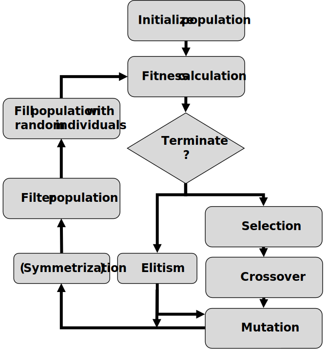
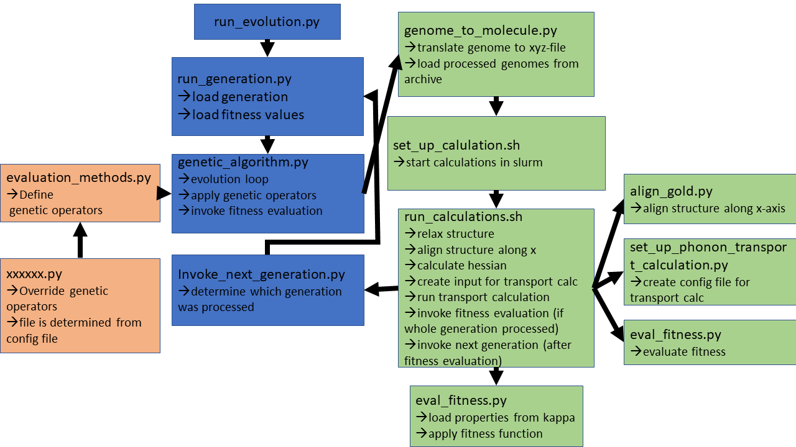
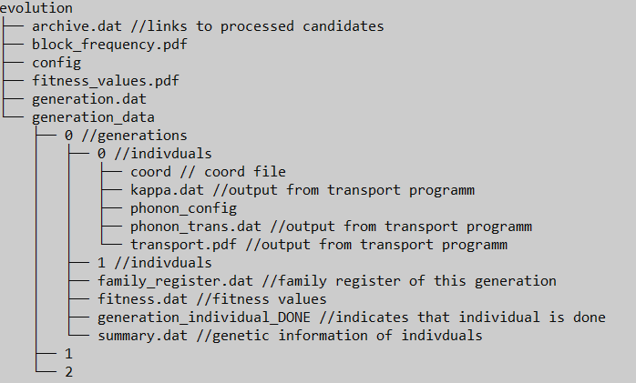

Genetic Algorithm
==============
Genetic Algorithm for the optimization of phonon transport in molecular junctions.


# Requirements

* Python 3.11 (should work with versions <3.12)
* Top library from  [here](https://github.com/blaschma/tmoutproc). Testet with v.0.2
* Phonon Transport Program from [here](https://github.com/blaschma/phonon_transport/). Testet with V.1.0. Also included in repo.
* [xtb](https://xtb-docs.readthedocs.io/en/latest/contents.html) (as module)
* [SLURM](https://slurm.schedmd.com/documentation.html) or GE
* Packages from requirements.txt

> **_NOTE:_**  Adapt ./src/helper_files/load_modules.sh \
> **_NOTE:_**  Standalone evaluation of molcules might be interesting. Check instructions below.

# Evolution



# Flow Chart


> **_NOTE:_**  Analysis scripts are not listed. 

# Usage 
### Preperation
* Create directory where the evolution runs
  * Generate directory "generation_data" in it
  * Create config file
### Config file
(With exemplary values. Adjust that to your calculations)
````
[Basics]
genetic_algorithm_path=#path to source code
xtb_path=#path to xtb module
helper_files=#path to helper files
archive_archive_path=#path to archive
calculation_path=#path to calculation
phonon_transport_programm=#path to phonon transport programm
queuing= (SLURM, GE or None)

[Genetic Algorithm]
population_size=60
generation_limit=10
evaluation_methods_path=tournament
n_blocks_max=5
n_blocks_min=2
insert_mutation_prob=0.5
coupling_mutation_prob=0.5
block_mutation_prob=0.5
substituent_mutation_prob=0.5
truncate_mutation_prob=0.5
n_tournament_selection=10
fitness_function="1+x"
substituent=H,F,C,B
substituent_prob=0.85,0.05,0.05,0.05
substituent_cost=0,0.5,0.5,0.5
force_symmetry=True
n_elitism=4
subs_penalty=True

[Building Procedure]
CC_bond_lengt=1.58
conjugation_angle=0.45
building_block_path=#path to building blocks
generation_data_path=generation_data
ang2Bohr=1.889725989
har2Ev=27.211
anchor=0

[Cluster Calculations]
partition=epyc
cpus_per_task=8
mem_per_cpu=16G
omp_stacksize=12G
max_time=05:30:00
kill_time=5700
relax_level=xtb
relax_iterations=730


[xtb Calculations]
xtb_level=extreme
gfn=1

[Phonon Calculation]
M_L=Au
M_C=Au
gamma=-4.0
E_D=20
N=2000
in_plane=False
T_min=0.1
T_max=600
kappa_grid_points=50
extended_ana=T (T or F)
````


> **_NOTE:_**  force_symmetry=True forces symmetric molecules. Forces symmetry regarding the building blocks. First genome part (left to center) is assumed to be dominant -> building blocks are symmetrized to right part. Couplings and substituent are not changed. Subs are filled up randomly if neccesary

### Fitness Function
The fitness function is parsed from the config file e.g. "1+x". x denotes the maximum kappa value for a individual. Quotation marks are important for correct parsing. The fitness of individuals with not converged calculations is set to zero. Following variables can be used:
* x: Maximum kappa value
* y: Substituent penalty
* z: Synthetic accessibility

### Run the evolution
* run python3 /genetic/run_evolution.py <config_path> <calculation_path>

### Output

---
> **_NOTE:_**  If calculations did not converge files like "RELAXATION_NOT_CONVERGED" are created and the fitness value is set to an error value. 

* **fitness_values.pdf** shows fitness value in each generation. Crossed indicate evolved individuals, dots indicate random individuals.
* **block_frequency.pdf** shows block frequency. The the five most common blocks are listed in the legend.
### Trouble Shooting
The evolution gets most likely stuck due to an error in the calculations for an individual:
* Find individual by missing _DONE file
  * Check Slurm Output or other logfiles
  * you can copy error files from the code dir
  * create _DONE file
  * run /helper_files/eval_fitness.py <path_to_process> <config_path>
  * run /genetic/inoke_next_generation <config_path> <calculation_path>
> **_NOTE:_**  If you want to process more generations after limit was reached: Increase generation limit in config file and run invoke_next_generation.py

# Standalone evaluation of molecules
run_calculations.sh in helper_files can be used to evaluate the phononic transport automatically. Just prepare directory with coord.xyz file. Molecule must be set up with Au-S or just S anchors (see anchor mode in config file). Then run following command:
````
run_calculations.sh PATH_TO_DIR_WITH_COORD PATH_TO_CONFIG $gen $id
````
$gen and $id are just used to name output files. Aditionally, masses of atoms can be manipulated. Just place "xtb.inp" file in coord directory with the following content:
````
$hess
modify mass: 23, 1.00794080
````
Multiple atoms can be modified by adding lines "modify mass: xx, 1.00794080". If file "xtb.inp" is detected, the mass of atom 23 (numbering starts at 1) in coord file is replaced by the hydrogen mass. Note: The mass given in xtb.inp-file is not used. Hydrogen is hard-coded (will be changed in future version)


***
Matthias Blaschke [matthias.blaschke@physik.uni-augsburg.de](matthias.blaschke@pyhsik.uni-augsburg.de)
